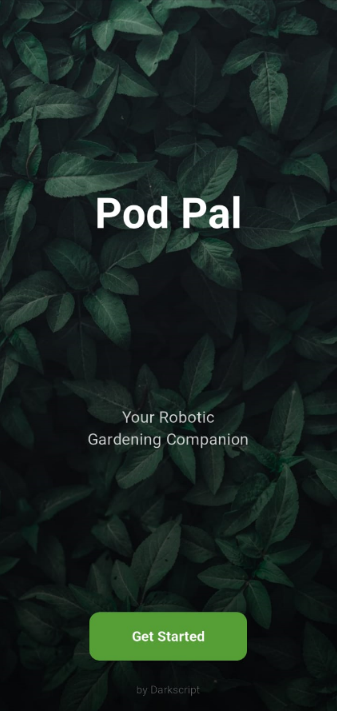
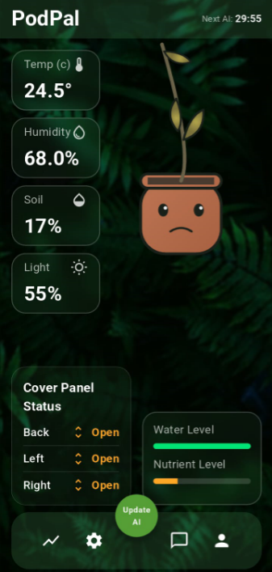
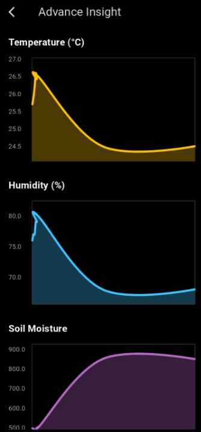
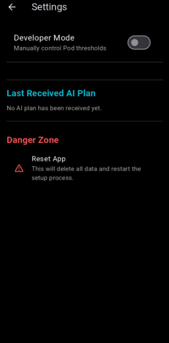
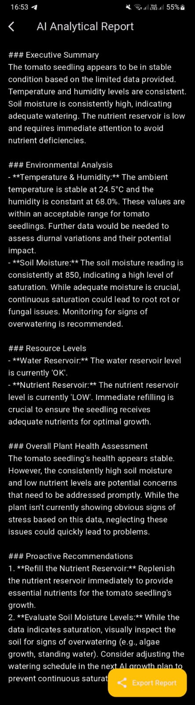
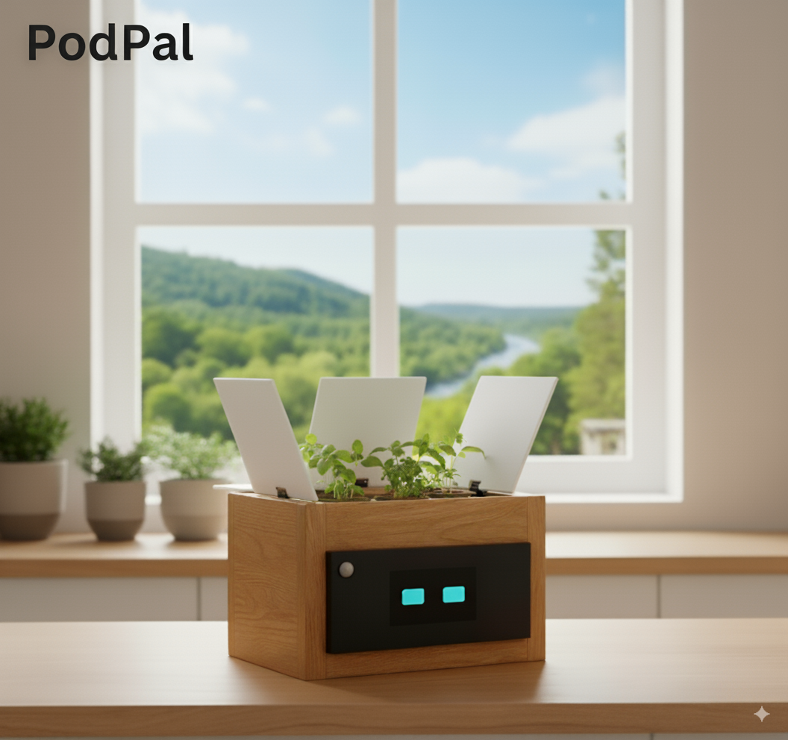

# PodPal - An AI-Powered Robotic Gardening Companion [Project Showcase]

> A project by **[Darkscript](https://github.com/darkscript-dev)**

This repository serves as a public showcase for the PodPal project, a smart plant pod that automates plant care through a closed-loop, AI-driven feedback system. It monitors the environment, sends data to a custom-trained AI, and receives adaptive growth plans to ensure your plants thrive.

**Please Note:** This repository contains the project documentation, screenshots, and an overview of the architecture. The source code for the applications and firmware is kept in a private repository to protect the project's intellectual property.

### The PodPal Ecosystem
The PodPal experience is delivered through two distinct applications, each designed for a specific purpose:

*   **📊 The Dashboard App:** The command center for the system, used for setup, monitoring detailed historical charts, and generating AI-powered analytical reports.
*   **😊 The Companion Display (PodFace):** An ambient display that provides an at-a-glance, emotional connection to the plant, showing if it's happy, thirsty, or sleeping. **[View the Public PodFace Repository Here](https://github.com/darkscript-dev/flutter-robot-face)**

<table>
  <tr>
    <td></td>
    <td></td>
  </tr>
  <tr>
    <td></td>
    <td></td>
  </tr>
</table>

  <b><i>AI-Powered Analytical Report</i></b>
   
  

## Key Features

*   **🤖 AI-Powered Analytical Reports:** Generates detailed daily health reports that analyze environmental trends, provide an expert assessment of the plant's health, and offer proactive recommendations.
*   **🧠 Adaptive Growth Plans:** The "AI Guardian" requests a new, optimized growth plan from Gemini every 30 minutes, using 12 hours of historical data to make intelligent, adaptive decisions about light, water, and climate.
*   **😊 Emotional Companion Display (PodFace):** A secondary app that provides an ambient, at-a-glance emotional connection to your plant, showing if it's happy, thirsty, or sleeping.
*   **📈 Historical Data Visualization:** Tracks temperature, humidity, soil moisture, and resource levels over time with clean, easy-to-read charts.
*   **🛠️ Full Manual Control:** A "Developer Mode" allows for precise manual control over every hardware component, from light thresholds to nutrient dosing schedules.

## Hardware & Architecture Overview

The PodPal hardware operates on a dual-microcontroller architecture to separate tasks efficiently.

*   **Arduino Due (Sensor Hub):** This microcontroller is directly connected to all sensors (DHT11, LDRs, etc.) and actuators (pumps, servos, fan). Its sole responsibility is to manage the plant's immediate environment.
*   **ESP8266 (Wi-Fi Bridge):** This microcontroller acts as a communication bridge, relaying JSON commands and sensor data between the Flutter apps and the Arduino Due.

## Future Roadmap

We are passionate about the future of PodPal and plan to evolve our current prototype into a fully integrated, self-contained product.

Our key development goals include:

*   **➡️ Integrated Companion Display:** Embed a Raspberry Pi and LCD screen directly into the PodPal, creating the elegant, all-in-one device shown in the concept image above.
*   **☁️ Cloud Dashboard for Researchers:** Create a web platform for the lab/greenhouse market, allowing them to manage and analyze data from a fleet of PodPals in real-time.
*   **🌱 Community-Sourced Growth Plans:** Allow users to share and download proven AI-generated growth plans for different types of plants.

## License

The documentation and media in this repository are distributed under the MIT License. See `LICENSE` for more information.
